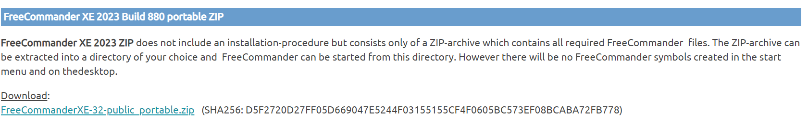

# FreeCommanderXE
# {1!} 關於
* 發佈日期: 2023-08-10
* 版號:
  * FreeCommander XE 2023 Build 880 32
* 連結:
  * [FreeCommander](https://freecommander.com/)
# {2!} 安裝
* 32位元版本是免費的。
* 本文採用免安裝壓縮檔。
* [下載](https://freecommander.com/en/downloads-portable/): FreeCommanderXE-32-public_portable.zip  

* 驗證Hash
  ```
  PS> (Get-FileHash .\FreeCommanderXE-32-public_portable.zip).Hash
  D5F2720D27FF05D669047E5244F03155155CF4F0605BC573EF08BCABA72FB778
  ```
* 因為最常使用, 建議\[釘選到工作列\]。
# {2!} 操作
## {2.1!} 快速鍵
| 功能                                                  | 快速鍵        | 原快速鍵   | 原功能 |
| ----------------------------------------------------- | ----------- | --------- | ----- |
| 檢視                                                  | F3          |           |      |
| 編輯                                                  | F4          |           |       |
| 比對檔案                                              | Ctrl + Z    | Ctr+Alt+V |      |
| 樹狀目錄                                              | Alt+T        |           |       |
| 樹狀最愛                                              | Alt+F        |           |       |
| 在右側開啟左側資料夾(lnk也行)<br>在檔案上會開啟相同的目錄             | Ctrl + Right |           |       |
| 在左側開啟右側資料夾(lnk也行)<br>在檔案上會開啟相同的目錄             | Ctrl + Left  |           |       |
|另側開資料夾|Alt + Double Click|||
| 快速檢視面板 | Ctrl + Q  ||看下方F10說明       |
|雙/單面板|F10|單板時檢視面板在右|雙板時檢視面板在下|
|開新Tab|Ctrl + T|||
|預設回到上次的Tab|Ctrl + PageUp|也可以按著Ctrl不放用上下鍵選取||
|名稱排序|Ctrl + F3|||
|命令提示字元|Ctrl + D|||
|等分|雙擊分割線|||
|更新|Ctrl + R|在網路磁碟移動目錄後原目錄沒消失,要更新後才反應||
### (1) 重新導向Win+E


### (1) File Container

* 可用複製貼上加入目錄或檔案
* 不要刪檔,要移除要用專門的功能

* 配合鎖定或Alt+double click在新Tab開啟目錄
### (2) 為什麼
* 在檔案總管可以釘選在工作列, 但freecommander沒有此選項。
* 在freecommander釘選到開始畫面是沒有作用的, 也要在檔案總管做。
* 在freecommander看不到資源回收筒。
### (2) 開啟程式
Office:F3-ulister,F4:LibreOffice
### (3) 快速檢視
* 使用`Ctrl+Q`開關快速檢視視窗,在雙視窗時會顯示在下方。
* 使用`F10`切換單雙視窗,切到單視窗時,可以重開快速檢視視窗,這樣就會開在右邊方便檢視。
### (4) 目前目錄右鍵(context menu)功能
* 在\[..\]的目錄上按右鍵就是此目錄的右鍵功能

### (5) 鎖定
* 使用鎖定可以永久有效,即使重啟也會存在,因為不瀏覽,開啟目錄都會開新Tab,有#符號可以知道此Tab被鎖定。

### (2) 改字型
* 為了中英等寛改用更紗黑體


* (這是不是搞錯了)選單:工具->設定(F12),   檢視->檔案/資料夾清單->色彩/字型
  本想改為(思源黑體):Noto Sans/緊縮/9/其他,但覺得預設的好看就不改了。
  
* (這是不是搞錯了)使用Cascadia Mono

### (3) 編輯器

### (4) 檢視器

### (5) 外部檢視器
* 圖片壓縮


### (5) 比較檔案

### (3) 顯示隱藏檔

* 放在工具列

* 改顏色,要在目錄之上。

### (4) 萬用檢視器
* uListr 4.0.0
https://totalcmd.net/plugring/oilister.html
* 要看reame.txt,需要另外下載Viewer Technology,要登入Oracle,並且同意License。
* 32位元:V1018544-01.zip, 64位元:V1018545-01.zip
* 將redist裡的元件複製到uLister目錄下就可以了。
* 排除影片
```
[ulister]
noloadtypes=1999|1700|1701|1702|1703|1704|1705|1706|1707|1708|1709|1710|1711|1712|1713|1714|1715|1716|1717|1718|1719|1720|1721|1722|1723|1724|1725||1726
nopreviewtypes=1999|1700|1701|1702|1703|1704|1705|1706|1707|1708|1709|1710|1711|1712|1713|1714|1715|1716|1717|1718|1719|1720|1721|1722|1723|1724|1725||1726
keepinmemory=1
```

### (3) 快速檢視器
* (3.1) 快速鍵 Ctrl+Q

* (3.2) 設定檢視器

* (3.3) 預設檢視器

* (3.4) 設在中間欄工具列

* (3.5) 快速篩選


### (4) 檢視圖片
* (4.1) 使用ImageGlass來檢視圖片
* **F3**: ImageGlass, **F4**: XShare, **double click**: paint.net

* (4.2) 快速檢視SVG
* **F3**: ImageGlass, **F4**: DrawIO, **double click**: Browser
需安裝SVGView 1.4.5,安裝完要重啟程式,因為我是single instance,所以要自行exit。
https://totalcmd.net/plugring/svgview.html

* (4.3) 檢視Markdown
需安裝WLX Markdown Viewer 2.3,安裝完要重啟程式,因為我是single instance,所以要自行exit。支援不完整, 無法顯示Table。
https://totalcmd.net/plugring/markdownviewer.html

* (4.4) 使用VS Code
  * -r --reuse-window (用已經開啟的Code)


### (2) 編輯圖片
* 使用ShareX來編輯圖片,Windows我會設paint.net為預計程式,只要double click開啟即可
* svg圖檔我預設用DrawIO來畫流程圖、架構圖、表格等。


### (1) Win+E開啟FreeCommander
不好用(反應慢),不勾。

### (2) 因為反應慢,設定只開一個不要關
* {允許顯示系統列圖示}不知道有什麼差。

### (3) 如何開啟Windows content menu
在面板空白處按滑鼠右鍵會出現freeCommander的content menu,想出現windows content menu可以用以下方式。
* Ctrl+滑鼠右鍵就好。
* 開啟content menu後再選到{內容功能表}來開啟

### (4) 比對兩個檔案
* 設winMerge來比對,自訂快速鍵F4
* 新增WinMerge的程式路徑,要勾選,帶入兩個參數

* 自訂快速鍵,篩選{比},修改{比較檔案}的快速鍵,{新快速鍵}設為{F4},顯示沒有功能用到,執行{分配},最認{確認}。


### (5) 開啟程式
1. double click: 用windows預設的應用程式開啟
2. 編輯器


| 篩選 | 程式 | 參數 |
| -------- | -------- | -------- |
| *     | C:\Program Files\Notepad++\notepad++.exe     | %AcceptOnlyFiles%     |

4. 檢視器
5. 外部檢視器:
6. 和{比較檔案}一樣,各自設定使用的程式。

### (6) 如何瀏覽路徑
* 設定按{路徑欄位}空白處的行為,預設會下拉歷史路徑,如果要自填路徑可用快速鍵Alt+G

* 快速鍵F4可以開啟瀏覽視窗

* 我不要歷史路徑,所以改設定,這樣就不用Alt+G了

### (7) 終端機
* ctrl + D


### (8) 自訂工具列
* 定義執行工具列

* 例如增加一個[我的最愛 - 樹狀目錄]

* DrawIO


### (9) 自訂顏色
* 對不同類型的副檔名設顏色區分

* 設定值

* \*.sln;\*.csproj;\*.exe;\*.bat : 255,128,0


### (10) 我的最愛
* 左右視窗的記錄下來,要注意目前活動面版會放在左邊,所以先聚焦在左面板再執行才會左右一致。

* 因為一次最多只能右左各一個tab,如果要一次開多個tab,要先設群組,然後在樹狀目錄執行[在分頁中開啟全部]。

* 編輯我的最愛,新增資料夾或檔案好像一樣,要群組是要加分類不是資料夾。

* 自訂排序及檢視時,如果目前的面板已符合路徑,就不會調整,保持目前的格式,看不到升降冪時將視窗拉寛一點就好。


### (11) 面板
* 將目前的目錄開啟在另一個視窗

* 使用快速鍵


| 命令              | 快速鍵      |
| ---------------- | ---------- |
| 在右側開啟左側資料夾 | Ctrl+Right |
| 在左側開啟右側資料夾 | Ctrl+Left  |


### (12) 快速篩選
* 面板下方

* {也用於資料夾名稱}要重新啟動FreeCommander才會生效

* 我的設定如下, 長度設100。

### (13) 消失的檔案及目錄
* `C:\Windows\System32\drivers`目錄底下有很多檔案及目錄不會顯示, 聽說使用64位元的FreeCommander就會正常,不過還好如果直接輸入`C:\WINDOWS\System32\drivers\etc`還是可以看到hosts檔案。
### (14) 分割欄熱點可見

* 分割欄會有明顯的圖示

## (二) 安裝及設定
### (1) 安裝
* 下載Portable版本,32位元是免費的。
https://freecommander.com/en/downloads-portable/

* 檔名: FreeCommanderXE-32-public_portable.zip
  版本: FreeCommander XE 2023 Build 880 32-bit public
* 確認Hash
```
PS D:\MyApp>get-filehash .\FreeCommanderXE-32-public_portable.zip

Algorithm       Hash                                                                   Path
---------       ----                                                                   ----
SHA256          D5F2720D27FF05D669047E5244F03155155CF4F0605BC573EF08BCABA72FB778       D:\MyApp\FreeCommanderXE-32-p...
```
* 習慣\[釘選到工作列\]

### (2) 只開一個不要關
* 因為反應慢,所以設定不要關閉,而且也不要多開程式
* {允許顯示系統列圖示}不知道有什麼差。

### (3) 設定完要退出
* 因為我設定只開一個要關,所以調整設定完後一定要自行退出,不然不會記錄(寫到freecommander.ini),如果當機重開設定都不見了。
### (4) 備份設定
* 初期會常常修改調整設定,所以改設定前先備份一下。

* 就放在Settings就好了,記得另外放一份複本。


### 變數


* 測試變數

* 想不到的用法
%AcceptOnlyFiles%


# {3!} 補充

## {3.1!} 比較目錄

Alt + V  


